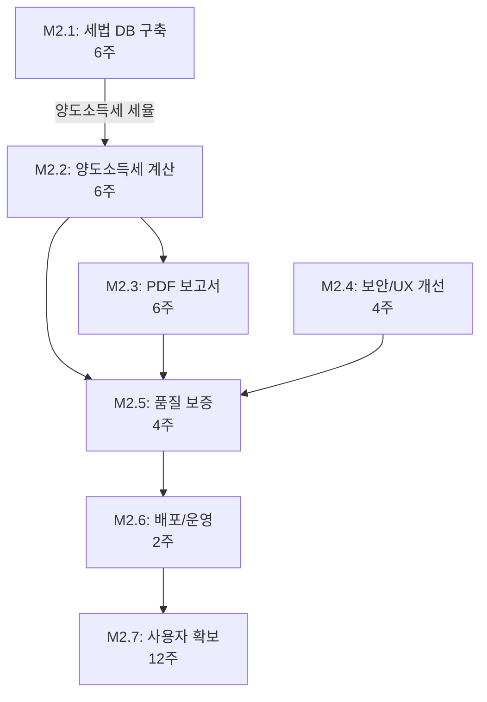

# Phase 2: Early Adoption - Visual Summary

## 📊 Overview

- **Duration**: 3개월 (12주)
- **Total Milestones**: 7개
- **Total Tasks**: 51개
- **Total Subtasks**: 156개
- **Estimated Hours**: 982시간
- **Target Period**: 2025 Q1

---

## 🎯 Milestone Breakdown

### M2.1: 세법 DB 구축 (6주) - P0 🔴
**Dependencies**: None
**Status**: Can start immediately

```
Week 1-2: 세율 테이블 데이터 수집
├─ 상속세 세율표 (4h)
├─ 증여세 세율표 (2h)
├─ 양도소득세 세율표 (6h) ⚡ M2.2 dependency
├─ 공제 한도 데이터 (4h)
└─ 세법 개정 이력 (8h)

Week 3-4: DB 스키마 설계 및 구현
├─ ERD 설계 (12h)
├─ PostgreSQL 스키마 (8h)
├─ 데이터 마이그레이션 (8h)
└─ 데이터 검증 로직 (6h)

Week 5-6: 자동 업데이트 시스템
├─ 국세청 공고 크롤러 (16h)
├─ 변경사항 알림 (8h)
├─ 버전 관리 (10h)
└─ 자동 업데이트 테스트 (6h)

Week 7: API 엔드포인트
├─ 세율 조회 API (6h)
├─ 공제 한도 API (4h)
├─ 세법 개정 이력 API (4h)
└─ API 문서화 (6h)
```

**Total**: 118 hours

---

### M2.2: 양도소득세 계산 추가 (6주) - P1 🟡
**Dependencies**: M2.1.1.3 (양도소득세 세율표)
**Status**: Waits for M2.1 partial completion

```
Week 1-2: 요구사항 분석 및 설계
├─ 계산 로직 분석 (12h)
├─ 사용자 시나리오 정의 (8h)
├─ 데이터 모델 설계 (6h)
└─ AI 프롬프트 템플릿 (4h)

Week 3-4: 계산 엔진 구현 (병렬 가능 ⚡)
├─ 부동산 양도소득세 (16h)
├─ 주식 양도소득세 (12h)
├─ 1세대1주택 비과세 (8h)
├─ 장기보유특별공제 (6h)
└─ 다주택자 중과세율 (8h)

Week 5: UI 통합 (병렬 가능 ⚡)
├─ 입력 폼 개발 (12h)
├─ 결과 표시 UI (8h)
└─ 비교표 업데이트 (6h)

Week 6: 테스트 및 검증
├─ Unit Test (8h)
├─ Integration Test (6h)
├─ 실제 사례 검증 (8h)
└─ 사용자 매뉴얼 (4h)
```

**Total**: 132 hours

---

### M2.3: PDF 보고서 생성 (6주) - P1 🟡
**Dependencies**: M2.2
**Status**: Waits for M2.2 completion

```
Week 1-2: 템플릿 디자인 (병렬 가능 ⚡)
├─ 레이아웃 설계 (12h)
├─ 로고 및 헤더/푸터 (6h)
├─ 비교표 디자인 (8h)
└─ 차트 가이드라인 (6h)

Week 3-4: jsPDF 통합 (병렬 가능 ⚡)
├─ 라이브러리 설치 (2h)
├─ PDF 생성 함수 (8h)
├─ 한글 폰트 임베딩 (6h)
├─ 테이블 렌더링 (10h)
└─ 이미지 임베딩 (8h)

Week 5: 차트 생성
├─ Chart.js 설정 (2h)
├─ 막대 그래프 (8h)
├─ 원형 차트 (6h)
└─ 차트→이미지 변환 (6h)

Week 6: 최적화 및 테스트
├─ 생성 속도 최적화 (8h)
├─ 다양한 시나리오 테스트 (6h)
├─ 인쇄 품질 검증 (4h)
└─ 브라우저 호환성 (4h)
```

**Total**: 110 hours

---

### M2.4: 보안 및 UX 개선 (4주) - P0 🔴
**Dependencies**: None
**Status**: Can start immediately (병렬 with M2.1)

```
Week 1: API 키 보안 관리
├─ AES-256 암호화 (8h)
├─ 키 유효성 테스트 (6h)
├─ 키 마스킹 UI (4h)
└─ 로그 보안 (4h)

Week 2: 데이터 암호화
├─ 민감 데이터 식별 (4h)
├─ HTTPS 강제 (4h)
├─ 저장 시 암호화 (8h)
└─ 암호화 키 관리 (6h)

Week 3: 에러 처리 개선
├─ 친화적 에러 메시지 (8h)
├─ 에러 복구 로직 (10h)
└─ 에러 로깅 (6h)

Week 4: 온보딩 개선
├─ 튜토리얼 개발 (12h)
├─ 샘플 데이터 (6h)
└─ 인라인 도움말 (6h)
```

**Total**: 92 hours

---

### M2.5: 품질 보증 및 테스팅 (4주) - P0 🔴
**Dependencies**: M2.2, M2.3, M2.4
**Status**: Waits for all features completion

```
Week 1: 성능 최적화
├─ 번들 크기 최적화 (10h)
├─ 렌더링 최적화 (8h)
├─ 이미지 최적화 (4h)
└─ Lighthouse 점수 (8h)

Week 2: Unit Test
├─ 세금 계산 로직 (12h)
├─ 유틸리티 함수 (8h)
└─ React 컴포넌트 (10h)

Week 3: Integration Test
├─ AI API 통합 (8h)
├─ 워크플로우 통합 (10h)
└─ 데이터 저장/로드 (6h)

Week 4: E2E Test
├─ Playwright 설정 (4h)
├─ 주요 플로우 테스트 (12h)
├─ 크로스 브라우저 (8h)
└─ 모바일 반응형 (6h)
```

**Total**: 114 hours

---

### M2.6: 배포 및 운영 (2주) - P0 🔴
**Dependencies**: M2.5
**Status**: Waits for all testing completion

```
Week 1: CI/CD 파이프라인
├─ GitHub Actions (8h)
├─ Vercel 배포 (4h)
├─ 환경 변수 관리 (2h)
└─ 배포 알림 (2h)

Week 2: Analytics 및 모니터링
├─ Google Analytics (6h)
├─ Mixpanel 통합 (6h)
├─ Sentry 에러 트래킹 (4h)
└─ 모니터링 대시보드 (6h)
```

**Total**: 38 hours

---

### M2.7: 사용자 확보 및 피드백 (12주) - P0 🔴
**Dependencies**: M2.6
**Status**: Runs throughout entire Phase 2

```
Week 1-12: 베타 테스트 프로그램 (지속적)
├─ 베타 테스터 모집 100명 (40h)
├─ 온보딩 가이드 (8h)
├─ 주간 사용 현황 (24h)
└─ 베타 테스터 인터뷰 (32h)

Week 1-2: 피드백 시스템
├─ 앱 내 피드백 버튼 (8h)
├─ 피드백 수집 폼 (4h)
├─ 피드백 관리 시스템 (4h)
└─ NPS 설문 (4h)

Week 3-4: 문서화 및 지원
├─ 사용자 가이드 업데이트 (12h)
├─ FAQ 페이지 (8h)
├─ 비디오 튜토리얼 (16h)
└─ 이메일 지원 (4h)
```

**Total**: 164 hours

---

## 🔄 Critical Path & Dependencies



**Critical Path**: M2.1 → M2.2 → M2.5 → M2.6 → M2.7

---

## ⚡ Parallel Execution Strategy

### Phase 2A (Week 1-6): Initial Setup
**병렬 수행 가능**:
- ✅ M2.1: 세법 DB 구축 (Backend focus)
- ✅ M2.4: 보안 및 UX 개선 (Frontend focus)

### Phase 2B (Week 7-12): Feature Development
**순차적 진행 (의존성)**:
1. M2.2: 양도소득세 계산 (M2.1 완료 후)
2. M2.3: PDF 보고서 (M2.2 완료 후)

**내부 병렬화**:
- M2.2: 로직 구현 ⚡ UI 개발
- M2.3: 템플릿 디자인 ⚡ jsPDF 통합

### Phase 2C (Week 13-16): Testing & Launch
**순차적 진행**:
1. M2.5: 품질 보증 (모든 기능 완료 후)
2. M2.6: 배포 및 운영 (테스트 완료 후)
3. M2.7: 사용자 확보 (배포 후 시작, 12주 지속)

---

## 📈 Task Priority Distribution

```
P0 (Critical): 18 tasks (35%)
├─ M2.1: 세법 DB 구축
├─ M2.4: 보안 및 UX
├─ M2.5: 품질 보증
├─ M2.6: 배포 및 운영
└─ M2.7: 사용자 확보

P1 (High): 33 tasks (65%)
├─ M2.2: 양도소득세 계산
└─ M2.3: PDF 보고서 생성

P2 (Medium): 0 tasks (0%)
```

---

## 👥 Resource Allocation

### Team Structure (Phase 2)
| Role | Count | Allocation | Key Responsibilities |
|------|-------|------------|---------------------|
| **Full-stack Developer** | 2 | 100% | M2.1, M2.2, M2.4 |
| **Backend Developer** | 1 | 100% | M2.1 (DB), M2.6 (CI/CD) |
| **Frontend Developer** | 1 | 100% | M2.2 (UI), M2.3 (PDF), M2.4 (UX) |
| **QA Engineer** | 1 | 100% | M2.5 (모든 테스팅) |
| **Product Manager** | 1 | 50% | M2.7 (베타 프로그램) |
| **Designer** | 1 | 30% | M2.3 (템플릿), M2.4 (UX) |

### Budget Estimate
```
Personnel: ₩75M (3개월)
Infrastructure: ₩5M
AI API: ₩7.5M
-----------------------
Total: ₩87.5M
```

---

## 🎯 Success Metrics (KPIs)

### Quantitative Targets
| Metric | Target | Measurement |
|--------|--------|-------------|
| 베타 사용자 수 | 100명 이상 | 등록 데이터 |
| 월 처리 건수 | 500건 이상 | Analytics |
| NPS | 50 이상 | 사용자 설문 |
| 시스템 가동률 | 99% 이상 | 모니터링 |

### Qualitative Goals
- ✅ 구체적이고 실행 가능한 피드백 수집
- ✅ 세법 DB 정확성 전문가 검증 완료
- ✅ PDF 보고서 실무 사용 가능 수준

---

## ⚠️ Risk Assessment

| Risk | Probability | Impact | Mitigation |
|------|------------|--------|------------|
| 세법 데이터 수집 지연 | Medium | High | 세무사 파트너십, 국세청 자료 |
| 양도소득세 로직 복잡도 | High | High | 단계적 구현, 전문가 검증 |
| PDF 생성 성능 이슈 | Medium | Medium | 백그라운드 처리, 캐싱 |
| 베타 테스터 확보 실패 | Medium | Critical | 무료 제공, 인센티브 |

---

## 📝 Task-Master-AI Integration

### Recommended Approach
1. **마일스톤별 프로젝트 생성**: 각 M2.x를 독립 프로젝트로 관리
2. **병렬 워커 할당**: M2.1과 M2.4 동시 착수
3. **의존성 체인 관리**: M2.1.1.3 완료 → M2.2 시작 트리거
4. **우선순위 기반 스케줄링**: P0 작업 우선 배정

### Optimization Opportunities
```
✅ M2.1: 데이터 수집 ⚡ 스키마 설계 (병렬)
✅ M2.2: 로직 구현 ⚡ UI 개발 (병렬)
✅ M2.3: 템플릿 디자인 ⚡ jsPDF 통합 (병렬)
✅ M2.4: 보안 강화 ⚡ UX 개선 (병렬)
✅ M2.1 & M2.4: 동시 착수 가능 (독립적)
```

---

## 📅 Recommended Timeline

```
Month 1 (Week 1-4):
├─ M2.1: 세법 DB (50% 완료)
└─ M2.4: 보안/UX (100% 완료)

Month 2 (Week 5-8):
├─ M2.1: 세법 DB (100% 완료)
├─ M2.2: 양도소득세 (50% 완료)
└─ M2.7: 베타 테스터 모집 시작

Month 3 (Week 9-12):
├─ M2.2: 양도소득세 (100% 완료)
├─ M2.3: PDF 보고서 (100% 완료)
├─ M2.5: 품질 보증 (100% 완료)
├─ M2.6: 배포/운영 (100% 완료)
└─ M2.7: 베타 프로그램 진행 중
```

---

## 🚀 Next Steps

1. **즉시 시작 가능** (Week 1):
   - M2.1: 세율 테이블 데이터 수집
   - M2.4: API 키 암호화 구현

2. **리소스 준비** (Before Week 1):
   - 팀 구성 완료
   - 세무사 파트너 확보
   - 개발 환경 셋업

3. **킥오프 미팅 아젠다**:
   - Phase 2 목표 및 KPI 공유
   - 마일스톤별 담당자 배정
   - 주간 스프린트 계획 수립
   - 커뮤니케이션 채널 설정

---

**Document Generated**: 2025-10-17
**Total Analysis Time**: Comprehensive Phase 2 breakdown complete
**Ready for task-master-ai integration**: ✅
