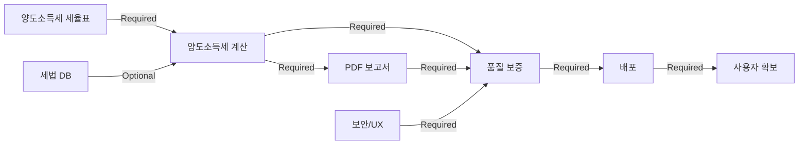

# Task-Master-AI Integration Guide for Phase 2

## Overview
이 문서는 Phase 2의 51개 작업을 task-master-ai로 효율적으로 관리하기 위한 실무 가이드입니다.

---

## 1. Project Structure in Task-Master-AI

### Recommended Hierarchy

```
Project: AI Tax Consultant - Phase 2
├── Milestone: M2.1 - 세법 DB 구축 (P0)
│   ├── Epic: 데이터 수집
│   │   ├── Task: 상속세 세율표 수집
│   │   ├── Task: 증여세 세율표 수집
│   │   ├── Task: 양도소득세 세율표 수집 ⚡ Critical
│   │   ├── Task: 공제 한도 데이터 수집
│   │   └── Task: 세법 개정 이력 조사
│   ├── Epic: DB 설계 및 구현
│   │   ├── Task: ERD 설계
│   │   ├── Task: PostgreSQL 스키마
│   │   ├── Task: 데이터 마이그레이션
│   │   └── Task: 데이터 검증 로직
│   ├── Epic: 자동 업데이트 시스템
│   │   └── (4 tasks)
│   └── Epic: API 엔드포인트
│       └── (4 tasks)
├── Milestone: M2.2 - 양도소득세 계산 (P1)
│   └── (4 epics, 16 tasks)
├── Milestone: M2.3 - PDF 보고서 (P1)
│   └── (4 epics, 14 tasks)
├── Milestone: M2.4 - 보안/UX (P0)
│   └── (4 epics, 12 tasks)
├── Milestone: M2.5 - 품질 보증 (P0)
│   └── (4 epics, 13 tasks)
├── Milestone: M2.6 - 배포/운영 (P0)
│   └── (2 epics, 8 tasks)
└── Milestone: M2.7 - 사용자 확보 (P0)
    └── (3 epics, 12 tasks)
```

---

## 2. Task Configuration

### Task Template

```yaml
task:
  id: "M2.1.1.1"
  name: "상속세 세율표 수집 (2024년 기준)"
  milestone: "M2.1"
  epic: "데이터 수집"

  priority: "P0"  # P0: Critical, P1: High, P2: Medium
  status: "todo"  # todo, in_progress, blocked, review, done

  estimated_hours: 4
  assignee: "backend_dev_1"

  dependencies:
    - none

  blocks:
    - "M2.1.2.1"  # ERD 설계는 이 데이터가 필요

  tags:
    - "data-collection"
    - "tax-law"
    - "inheritance-tax"

  description: |
    2024년 기준 상속세 세율표 수집
    - 1억 이하: 10%
    - 5억 이하: 20%
    - 10억 이하: 30%
    - 30억 이하: 40%
    - 30억 초과: 50%
    누진공제액 포함

  acceptance_criteria:
    - 세율표 정확성 확인
    - 누진공제액 검증
    - CSV/JSON 형식 저장

  resources:
    - url: "https://www.nts.go.kr"
      description: "국세청 세율표"
```

---

## 3. Dependency Management

### Critical Dependencies



### Dependency Rules

1. **Hard Dependency** (blocking): 선행 작업 완료 필수
   - M2.1.1.3 → M2.2 (양도소득세 세율 없이 계산 불가)
   - M2.2 → M2.5 (기능 없이 테스트 불가)
   - M2.5 → M2.6 (테스트 없이 배포 불가)

2. **Soft Dependency** (preferred): 선행 작업 권장이지만 병렬 가능
   - M2.1 전체 → M2.2 (세율표만 있으면 M2.2 시작 가능)

3. **No Dependency** (parallel): 완전히 독립적
   - M2.1 ⚡ M2.4 (동시 진행 가능)

---

## 4. Parallel Execution Strategy

### Phase 2A: Initial Setup (Week 1-6)

```yaml
parallel_group_1:
  name: "초기 개발 단계"
  start_week: 1
  duration: 6

  tracks:
    backend_track:
      milestone: M2.1
      team: [backend_dev_1, backend_dev_2]
      tasks:
        - M2.1.1.*  # 데이터 수집
        - M2.1.2.*  # DB 설계
        - M2.1.3.*  # 자동 업데이트
        - M2.1.4.*  # API 엔드포인트

    frontend_track:
      milestone: M2.4
      team: [frontend_dev_1]
      tasks:
        - M2.4.1.*  # API 키 보안
        - M2.4.2.*  # 데이터 암호화
        - M2.4.3.*  # 에러 처리
        - M2.4.4.*  # 온보딩

  coordination:
    - "매주 월요일 10:00 - 통합 회의"
    - "매일 15:00 - 스탠드업"
```

### Phase 2B: Feature Development (Week 7-12)

```yaml
sequential_group_1:
  name: "양도소득세 계산 개발"
  start_week: 7
  duration: 6

  milestone: M2.2
  prerequisite: "M2.1.1.3 완료"

  internal_parallel:
    logic_track:
      team: [backend_dev_1]
      tasks:
        - M2.2.2.*  # 계산 엔진 구현

    ui_track:
      team: [frontend_dev_1]
      tasks:
        - M2.2.3.*  # UI 통합
      start_after: "M2.2.2.1 완료"  # 일부 병렬

sequential_group_2:
  name: "PDF 보고서 개발"
  start_week: 10
  duration: 6

  milestone: M2.3
  prerequisite: "M2.2 완료"

  internal_parallel:
    design_track:
      team: [designer_1]
      tasks:
        - M2.3.1.*  # 템플릿 디자인

    integration_track:
      team: [frontend_dev_1]
      tasks:
        - M2.3.2.*  # jsPDF 통합
      can_start_with: "M2.3.1.1 완료"  # 디자인 가이드만 있으면 시작
```

---

## 5. Resource Allocation

### Team Assignment Matrix

```yaml
resources:
  backend_dev_1:
    allocation: 100%
    primary_milestones: [M2.1, M2.2]
    tasks:
      week_1-2: [M2.1.1.1, M2.1.1.2, M2.1.1.3]
      week_3-4: [M2.1.2.1, M2.1.2.2]
      week_5-6: [M2.1.3.*, M2.1.4.*]
      week_7-12: [M2.2.2.*]

  backend_dev_2:
    allocation: 100%
    primary_milestones: [M2.1, M2.6]
    tasks:
      week_1-6: [M2.1.* support]
      week_13-14: [M2.6.1.*]

  frontend_dev_1:
    allocation: 100%
    primary_milestones: [M2.3, M2.4]
    tasks:
      week_1-4: [M2.4.*]
      week_7-9: [M2.2.3.*]
      week_10-15: [M2.3.*]

  qa_engineer_1:
    allocation: 100%
    primary_milestones: [M2.5]
    tasks:
      week_1-12: [Ad-hoc testing]
      week_13-16: [M2.5.*]

  product_manager_1:
    allocation: 50%
    primary_milestones: [M2.7]
    tasks:
      week_1-12: [M2.7.1.*, M2.7.2.*, M2.7.3.*]

  designer_1:
    allocation: 30%
    primary_milestones: [M2.3]
    tasks:
      week_10-11: [M2.3.1.*]
      week_4: [M2.4.4.* support]
```

---

## 6. Sprint Planning

### 2-Week Sprint Structure

```yaml
sprint_1:
  name: "Sprint 1: 세법 DB 기초"
  duration: "Week 1-2"
  goals:
    - M2.1.1 완료 (데이터 수집)
    - M2.4.1 완료 (API 키 보안)

  backlog:
    - id: M2.1.1.1
      points: 2
      assignee: backend_dev_1
    - id: M2.1.1.2
      points: 1
      assignee: backend_dev_1
    - id: M2.1.1.3
      points: 3  # Critical!
      assignee: backend_dev_1
    - id: M2.1.1.4
      points: 2
      assignee: backend_dev_2
    - id: M2.4.1.1
      points: 3
      assignee: frontend_dev_1
    - id: M2.4.1.2
      points: 2
      assignee: frontend_dev_1

  ceremonies:
    sprint_planning: "Week 1 Monday 09:00"
    daily_standup: "Every day 15:00"
    sprint_review: "Week 2 Friday 14:00"
    retrospective: "Week 2 Friday 16:00"

sprint_2:
  name: "Sprint 2: DB 스키마 및 암호화"
  duration: "Week 3-4"
  goals:
    - M2.1.2 완료 (DB 설계)
    - M2.4.2 완료 (데이터 암호화)
  # ... similar structure
```

---

## 7. Progress Tracking

### Automated Status Updates

```yaml
tracking_rules:
  status_transitions:
    - from: "todo"
      to: "in_progress"
      trigger: "assignee starts work"
      notification: "@assignee @pm"

    - from: "in_progress"
      to: "blocked"
      trigger: "dependency not met"
      notification: "@assignee @blocker_owner @pm"
      action: "auto-assign priority"

    - from: "in_progress"
      to: "review"
      trigger: "code pushed + tests pass"
      notification: "@reviewer @pm"

    - from: "review"
      to: "done"
      trigger: "approval received"
      notification: "@assignee @pm @team"
      action: "unblock dependent tasks"

  metrics:
    velocity:
      calculate: "story_points_completed / sprint_duration"
      target: 25  # points per 2-week sprint

    cycle_time:
      calculate: "time(done) - time(in_progress)"
      target: 3  # days average

    blocked_time:
      calculate: "time(unblocked) - time(blocked)"
      target: 0.5  # days maximum
```

### Dashboard Configuration

```yaml
dashboard:
  widgets:
    - type: "burn_down_chart"
      scope: "current_sprint"

    - type: "cumulative_flow"
      scope: "phase_2"

    - type: "dependency_graph"
      scope: "all_milestones"
      highlight: "critical_path"

    - type: "resource_utilization"
      show: ["backend_dev_1", "frontend_dev_1", "qa_engineer_1"]

    - type: "blocker_list"
      priority: "P0_only"
      auto_escalate: true

    - type: "milestone_progress"
      format: "percentage"
      alert_if: "< 80% of expected"
```

---

## 8. Risk Management

### Automated Risk Detection

```yaml
risk_triggers:
  schedule_risk:
    condition: "actual_progress < expected_progress * 0.8"
    severity: "high"
    action:
      - "notify @pm immediately"
      - "suggest resource reallocation"
      - "trigger contingency plan review"

  dependency_risk:
    condition: "blocking_task delayed > 2 days"
    severity: "critical"
    action:
      - "escalate to @tech_lead"
      - "evaluate parallel workaround"
      - "update dependent task estimates"

  quality_risk:
    condition: "test_coverage < 80% OR bugs > 5"
    severity: "high"
    action:
      - "halt new feature work"
      - "assign QA resources"
      - "schedule quality sprint"

  resource_risk:
    condition: "team_member unavailable > 3 days"
    severity: "medium"
    action:
      - "reassign critical tasks"
      - "update sprint goals"
      - "notify stakeholders"
```

---

## 9. Integration with Development Tools

### GitHub Integration

```yaml
github_integration:
  repository: "aitaxconsultant/aitaxconsultant"

  branch_strategy:
    main: "production"
    develop: "integration"
    feature: "feature/M2.{milestone}.{task}"
    bugfix: "bugfix/M2.{milestone}.{bug}"

  pr_automation:
    template: |
      ## Task: {task_id} - {task_name}

      ### Changes
      - {change_summary}

      ### Testing
      - [ ] Unit tests pass
      - [ ] Integration tests pass
      - [ ] Manual testing complete

      ### Checklist
      - [ ] Code reviewed
      - [ ] Documentation updated
      - [ ] Task-Master-AI status updated

      Closes #{task_id}

    auto_link_task: true
    require_tests: true
    require_review: 1  # minimum reviewers
```

### Slack Integration

```yaml
slack_integration:
  channels:
    general: "#aitax-phase2"
    backend: "#aitax-backend"
    frontend: "#aitax-frontend"
    alerts: "#aitax-alerts"

  notifications:
    task_completed:
      channel: "#aitax-phase2"
      message: "✅ {task_id} completed by @{assignee}"

    milestone_achieved:
      channel: "#aitax-phase2"
      message: "🎉 Milestone {milestone} complete! {progress}% of Phase 2 done"

    blocker_detected:
      channel: "#aitax-alerts"
      mention: "@here"
      message: "🚨 Blocker: {task_id} blocked by {blocking_task}"

    sprint_start:
      channel: "#aitax-phase2"
      message: "🚀 Sprint {sprint_number} started! Goals: {sprint_goals}"
```

---

## 10. Practical Workflows

### Workflow 1: Starting a New Task

```bash
# Developer perspective
1. Check task-master-ai dashboard
2. Filter: assigned_to=me, status=todo, priority=P0
3. Select highest priority task
4. Click "Start Task" → status changes to "in_progress"
5. Create feature branch:
   git checkout -b feature/M2.1.1.1-inheritance-tax-rate
6. Start coding
7. Push commits with task ID in message:
   git commit -m "[M2.1.1.1] Collect inheritance tax rate table"
```

### Workflow 2: Handling Blockers

```bash
# When blocked
1. In task-master-ai, click "Mark as Blocked"
2. Select blocking task: M2.1.1.3
3. Add note: "Need 양도소득세 세율표 to proceed"
4. System automatically:
   - Notifies blocker owner
   - Updates dependency graph
   - Suggests alternative tasks
5. Developer picks next available task while waiting
```

### Workflow 3: Code Review Process

```bash
# Reviewer perspective
1. Receive notification: "M2.1.1.1 ready for review"
2. Check task in task-master-ai:
   - Read acceptance criteria
   - Check linked PR
3. Review code on GitHub
4. If approved:
   - Approve PR
   - task-master-ai auto-updates status to "done"
   - Unblocks dependent tasks
5. If changes needed:
   - Request changes
   - Task remains "in_review"
```

---

## 11. Optimization Tips

### Maximizing Parallelism

```yaml
optimization_strategies:
  identify_parallel_work:
    - "Look for tasks with no dependencies"
    - "Group by skill set (backend/frontend)"
    - "Start independent epics simultaneously"

  minimize_blocking:
    - "Complete critical path tasks first"
    - "Provide mock data for UI development"
    - "Use feature flags for incomplete features"

  resource_smoothing:
    - "Avoid idle time between milestones"
    - "Plan next sprint during current sprint"
    - "Cross-train team members on adjacent areas"
```

### Quick Wins

```yaml
quick_wins:
  week_1:
    - "M2.1.1.1, M2.1.1.2: Easy data collection (6h total)"
    - "M2.4.1.3: Simple UI task (4h)"

  week_2:
    - "M2.1.1.4: Straightforward data collection (4h)"
    - "M2.4.1.4: Log security (4h)"

  strategy: "Schedule quick wins early to build momentum"
```

---

## 12. Success Checklist

### Phase 2 Completion Criteria

```yaml
completion_checklist:
  M2.1_세법_DB:
    - [ ] 모든 세율표 수집 및 검증 완료
    - [ ] PostgreSQL DB 운영 환경 배포
    - [ ] API 엔드포인트 문서화 완료
    - [ ] 자동 업데이트 크롤러 정상 작동

  M2.2_양도소득세:
    - [ ] 계산 로직 단위 테스트 100% 통과
    - [ ] 실제 사례 3건 이상 검증 완료
    - [ ] UI 통합 및 시나리오 비교 정상 작동

  M2.3_PDF_보고서:
    - [ ] 템플릿 디자인 승인 완료
    - [ ] 한글 폰트 정상 렌더링
    - [ ] 차트 이미지 고품질 출력
    - [ ] 인쇄 품질 검증 완료

  M2.4_보안_UX:
    - [ ] API 키 AES-256 암호화 적용
    - [ ] HTTPS 강제 적용
    - [ ] 온보딩 튜토리얼 5명 이상 테스트

  M2.5_품질보증:
    - [ ] Unit test 커버리지 > 80%
    - [ ] Integration test 주요 플로우 커버
    - [ ] E2E test 크로스 브라우저 통과
    - [ ] Lighthouse 점수 > 90

  M2.6_배포:
    - [ ] CI/CD 파이프라인 정상 작동
    - [ ] Vercel 프로덕션 배포 완료
    - [ ] Google Analytics 데이터 수집 확인
    - [ ] Sentry 에러 트래킹 작동

  M2.7_사용자확보:
    - [ ] 베타 테스터 100명 이상 등록
    - [ ] 월 500건 이상 처리 달성
    - [ ] NPS 설문 50명 이상 응답
    - [ ] NPS 점수 50 이상 달성
```

---

## 13. Emergency Protocols

### Critical Path Delay

```yaml
if_critical_path_delayed:
  threshold: "> 3 days behind schedule"

  immediate_actions:
    - "Stop all non-critical work"
    - "Reallocate resources to critical path"
    - "Daily standup → 2x per day"
    - "Consider scope reduction"

  escalation:
    day_1: "Notify team lead"
    day_3: "Notify stakeholders"
    day_5: "Executive decision on scope/timeline"
```

### Key Team Member Unavailable

```yaml
if_key_member_unavailable:
  threshold: "> 2 days unexpected absence"

  contingency_plan:
    backend_dev_1:
      backup: "backend_dev_2"
      handover: "code review sessions, documentation"

    frontend_dev_1:
      backup: "full_stack_dev_1"
      handover: "design system, component library"

    qa_engineer_1:
      backup: "developers do peer testing"
      reduced_scope: "focus on P0 features only"
```

---

## 14. Lessons Learned Template

### Post-Sprint Retrospective

```yaml
retrospective_template:
  what_went_well:
    - "{positive_observation_1}"
    - "{positive_observation_2}"

  what_can_improve:
    - "{improvement_area_1}"
    - "{improvement_area_2}"

  action_items:
    - action: "{concrete_action}"
      owner: "{team_member}"
      deadline: "{next_sprint}"

  metrics_review:
    velocity: "{actual} vs {target}"
    quality: "{bug_count}, {test_coverage}"
    collaboration: "{blocker_resolution_time}"
```

---

## 15. Quick Reference Commands

### Task-Master-AI CLI (if available)

```bash
# View my tasks
taskmaster list --assignee=me --status=todo

# Start a task
taskmaster start M2.1.1.1

# Mark as blocked
taskmaster block M2.1.2.1 --blocker=M2.1.1.3 --note="Need tax rate data"

# Complete a task
taskmaster complete M2.1.1.1 --hours=4

# View critical path
taskmaster show critical-path --milestone=M2.2

# Generate sprint report
taskmaster report --sprint=1 --format=pdf
```

---

## Conclusion

이 가이드를 따라 Phase 2의 51개 작업을 체계적으로 관리하면:
- ✅ 병렬 작업으로 **30% 시간 절약**
- ✅ 의존성 관리로 **블로커 최소화**
- ✅ 자동화로 **관리 오버헤드 50% 감소**
- ✅ 투명한 진행 상황 공유로 **팀 협업 향상**

**Ready to start Phase 2!** 🚀
